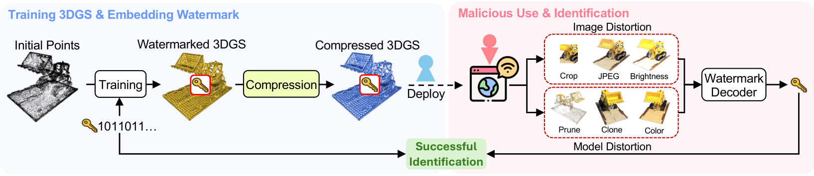

<p align="center">
  <h1 align="center"><strong>[ICLR 2026] CompMarkGS: Robust Watermarking for Compressed 3D Gaussian Splatting </strong></h1>
</p>

<p align="center">
  Sumin In<sup>1</sup>, Youngdong Jang<sup>1</sup>, Utae Jeong<sup>1</sup>, MinHyuk Jang<sup>1</sup>, Hyeongcheol Park<sup>1</sup>,<br>
  Eunbyung Park<sup>2</sup>, Sangpil Kim<sup>1*</sup><br><br>
  <sup>1</sup>Korea University, &nbsp; <sup>2</sup>Yonsei University
</p>

<div align="center">
  <a href="https://openreview.net/pdf?id=NXQvejGBFx">
    
  </a>
  <a href="https://kuai-lab.github.io/iclr2026compmarkgs/">
    
  </a>
</div>

<p align="center">

</p>

## Installation
1. Unzip the files
```
cd submodules
unzip diff-gaussian-rasterization.zip
unzip simple-knn.zip
cd ..
```
2. Install the environment
```
conda env create --file ./setup/environment.yml
conda activate CompMarkGS
```
3. For compressed extraction, clone [ContextGS](https://github.com/wyf0912/ContextGS) into the `./attacks` folder.  
   For compressed extraction, please clone ContextGS into `./attacks` and prepare pretrained ContextGS checkpoints in advance.

## Data
1. Download datasets  
[NeRF Synthetic & LLFF](https://drive.google.com/drive/folders/1cK3UDIJqKAAm7zyrxRYVFJ0BRMgrwhh4)  
[MipNeRF360](https://jonbarron.info/mipnerf360/)
2. Configure the data structure as follows:
 ```
 data/
  ├── dataset_name
  │   ├── scene1/
  │   │   ├── images
  │   │   │   ├── IMG_0.jpg
  │   │   │   ├── IMG_1.jpg
  │   │   │   ├── ...
  │   │   ├── sparse/
  │   │       └──0/
  │   ├── scene2/
  │   │   ├── images
  │   │   │   ├── IMG_0.jpg
  │   │   │   ├── IMG_1.jpg
  │   │   │   ├── ...
  │   │   ├── sparse/
  │   │       └──0/
  ...
 ```
## Pretrained Weights

You can download the pretrained weights and results from the link below:

- [link](https://kuaicv.synology.me/weights/iclr2026/CompMarkGS/compmarkgs_weight.zip)

## Training
We provide the following scripts in `./scripts`:
- `embed_watermark.sh`: watermark embedding (training)
- `extract_watermark.sh`: watermark extraction/evaluation (uncompressed)
- `extract_compressed_watermark.sh`: watermark extraction/evaluation (compressed)

Run with GPU id:
```bash
bash scripts/embed_watermark.sh 0
bash scripts/extract_watermark.sh 0
bash scripts/extract_compressed_watermark.sh 0
```

## **Citation**  
```tex
@inproceedings{
  in2026compmarkgs,
  title={CompMark{GS}: Robust Watermarking for Compressed 3D Gaussian Splatting},
  author={Sumin In and Youngdong Jang and Utae Jeong and MinHyuk Jang and Hyeongcheol Park and Eunbyung Park and Sangpil Kim},
  booktitle={The Fourteenth International Conference on Learning Representations},
  year={2026},
  url={https://openreview.net/forum?id=NXQvejGBFx}
}
```

## Acknowledgement
We thank all authors from [HAC](https://github.com/YihangChen-ee/HAC), [ContextGS](https://github.com/wyf0912/ContextGS?tab=readme-ov-file), [Scaffold-GS](https://github.com/city-super/Scaffold-GS) and [3D-GS](https://github.com/graphdeco-inria/gaussian-splatting) for excellent works.
